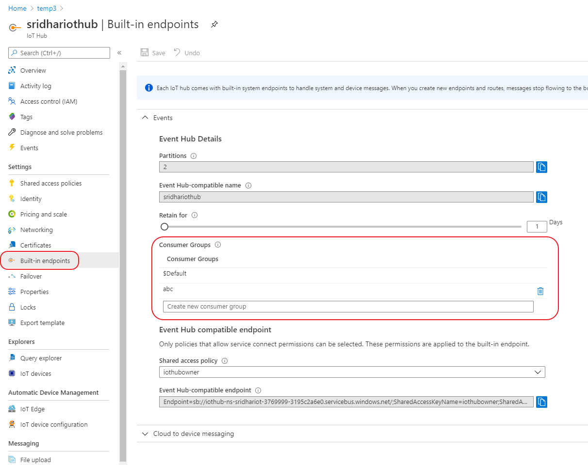
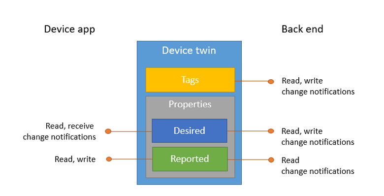
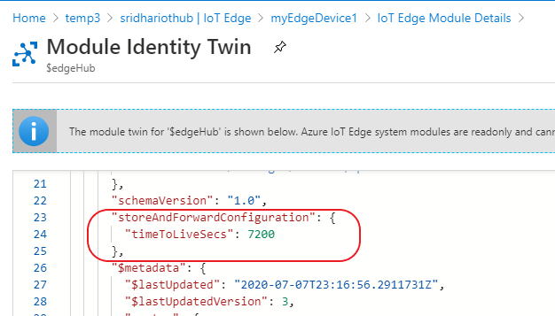
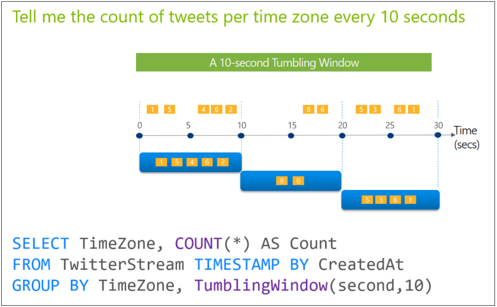
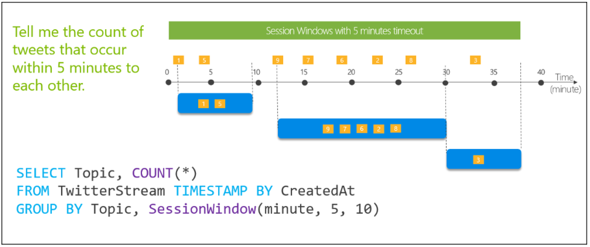
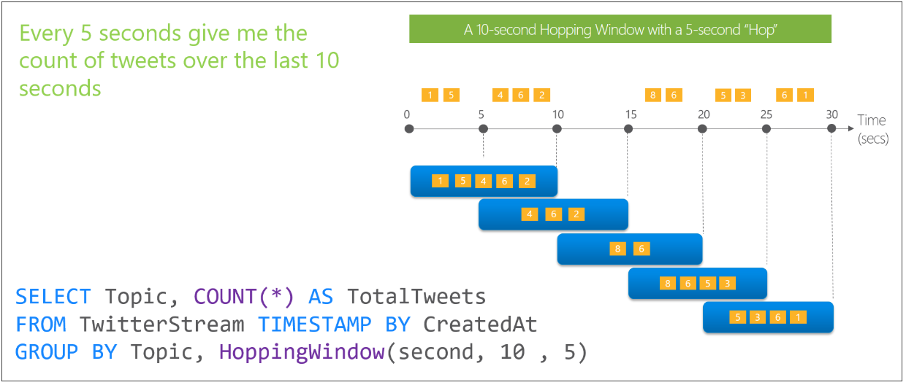

## IoT FAQ

## Tier

### How to choose the Azure IoT Hub tier
   
Azure IoT Hub offers two subscription tiers, Basic (B) and Standard (S). Each tier offers different features, Basic
does not support bi-directional communication. Each tier is further divided into three sizes, 1 through 3. The size
determines the number of messages the hub can handle on a daily basis. You can purchase multiple units of the same size
up to the daily message limit.

For example:
* S1, One unit   - This would only support up to 400,000 messages per day
* S1, Two unit   - This would only support up to 800,000 messages per day
* S1, Three unit - This would only support up to 1200,000 messages per day
* S2, One unit   - This would only support up to 6,000,000 messages per day
* S2, Two unit   - This would only support up to 12,000,000 messages per day
* S2, Three unit - This would only support up to 18,000,000 messages per day
* S3, One unit   - This would only support up to 300,000,000 messages per day
* S3, Two unit   - This would only support up to 600,000,000 messages per day
* S3, Three unit - This would only support up to 900,000,000 messages per day

Example: <br> 
5000 devices each generating 100,000 messages per day this is a total of 500,000,000 messages per day
Since S3, 1 unit will support up to 300,000,000 messages it will not be enough, you need to move up. i.e S3 2 units
this will be 300,000,000 * 2 = 600,000,000 messages/day


### Calculate messages per day

You deploy 2000 IoT devices, each device sends 1024 bytes of messages every 20 seconds

devices = 2000 <br>
message size = 1KB <br>
Number of times per minute = 3 (every 20 seconds) <br>
Messages per minute = 2000 * 1 * 3 = 6000 KB/minute <br>
Messages per day = 6000 * 1440 = 8,640,000 <br>

Use S2, 2 units


    
## IoT Hub

### How to create consumer groups in IoT Hub

A consumer group is an event reader that will be used to ingest dta from Azure IoT Hub. You can use the $Default consumer
group or create a new one. In order to prevent resource contention between event readers, you should create a dedicated 
consumer group.



You need to configure Time Series Insights (TS) to receive all telemetry data
1. Create a consumer group in the IoT hub
2. Add a new event source to the Time Series Insights (TSI) environment
3. Configure the event source to use the consumer group    

### Enable diagnostics logs

You can enable diagnostics logs and send the output to Event Hub from where external Security Information and Event 
Management (SIEM) systems can consume the data. or send it to log analytics 

### Monitoring IoT Hub

You should use Azure Monitor to generate an email alert when there are failed IoT Hub jobs. Diagnostic logging is disabled
by default and must be enabled, and a log analytics workspace must be selected as the logging destination before you can 
use Azure Monitor to analyze and query IoT hub logs. Diagnostic logs are not real-time, so it may take some time before
the data is available to Azure monitor

You should use IoT Hub metrics to view real-time device data activity including the number of telemetry messages delivered.
Metrics are enabled by detault. You can configure Azure IoT Hub metrics to display real-time device activity. IoT Hub metrics 
enable you to assess the overall health of the IoT Hub service and the device connected to it. The Iot Hub does not generate 
alerts but leverages Azure Monitor for alerting

### How to debug telemetry data is reaching IoT Hub

1. Open IoT Hub configuration in Azure
2. Select Monitoring - Metrics
3. Apply scope to your IoT Hub
4. Create a new chart for the Telemetry messages sent metric

### How to debug and a device is failing to connect to IoT Hub

You discover that one of your field devices is failing to connect to the IoT Hub. You verify that the device is registered
with the IoT Hub. You use ssh to connect to the device successfully and verify that the SAS  token has not expired. You 
suspect that there is a issue with networking or a firewall. What should you do?
Run the "iothub-diagnostics" tool

The tool attempts to connect to the IoT Hub with the device's credentials, and produce a high level report on successful 
and failed connectivity tets.

### Device provisioning using HMS (Hardware security modules)

IoT devices are equipped with the hardware security modules (HSM). You want to use Trusted Platform Module (TPM) based
identity attestation to take advantage of HSM capability of IoT devices. Required endorsement key (EK) and storage root
key (SRK) are already in place. 

Steps:
1. The IoT device sends provisioning request
2. DPS sends nonce challenge
3. The IoT device decrypts nonce with Required endorsement key (EK) and storage root keys (SRK)
4. The IoT device sends Shared Access Signature (SAS) token signed by nonce
5. DPS verifies Shared Access Signature (SAS) token and provisions IoT device to IoT Hub

## Protocol

### Which protocol should be used, if the payload needs to be small? <br>
    
    You should use AMQP. AMQP is a binary protocol, so its payload is more compact than the one in HTTPS. It is also the 
    only protocol that supports field gateways with connection multiplexing across IoT sensors. AMQP also uses port 567, 
    which is allowed on your Azure IoT hub.<br>

    You should not use MQTT or MQTT over SebSockets. MQTT uses port 8883 or port 443 (using MQTT over WebSockets) on the 
    networks that allows HTTPS protocols only.MQTT is a binary protocol like AMQP, so it has a relatively compact payload 
    size. However, it does not support connection multiplexing.

    You should not use HTTPS, HTTPS has the biggest payload size compared to more compact binary protocols like AMQP or 
    MQTT, and it uses port 443. However, it does not support connection multiplexing, which does not meet the technical 
    and security requirements of your organization.

### Which protocol to use <br>
   * Communication over high latency networks must be supported
   * The protocol footprint must be minimal, requiring less than 1MB RAM
   * The protocol must use commonly open firewall ports
    
   You should use MQTT over WebSockets. MQTT was designed to be light weight both operationally and from a code footprint
    standpoint. This is ideally suited to environments where latency may be introduced due to unreliable communication 
    methods. MQTT over WebSockets operates over port 443, which is a commonly open firewall port for HTTPS.
    
   You should not use MQTT. MQTT operates natively over port 8883, which is not a commonly open firewall port
    
   You should not use AMQP. Like MQTT, AMQP is commonly used in IoT communications. AMQP is more robost than MQTT, offers a 
   broader set of features, and can take advantage of connection multiplexing. As a result, the AMQP footprint is larger 
   than MQTT, and it is not used on devices with less than 1MB RAM. AMQP operates over port 5671.
    
   You should not use AMQP over WebSockets. AMQP over WebSockets is not used on devices with less than 1MB RAM. AMQP over
   WebSockers operates over port 443
    
   You should not use HTTPS. HTTPS is recommended only for devices that do not support MQTT or AMQP because it was not 
   designed for IoT device communications. While HTTS has a smaller footprint than AMQP, this requires larger payload to
   transfer the same information than MQTT or AMQP. MQTT is better for high-latency communications. 
    
### Which protocol to use <br>
   * Device type 1 is an IoT camera that uploads large media files ==> HTTPS
   * Device type 2 is a remotely located flow sensor that uses unreliable satellite communications to send telemetry data
    ==> MQTT
   * Device type 3 is an IoT gateway that requires connection multiplexing ==> AMQP
    
   You should use HTTPS on Device Type 1. HTTPS is a common Internet protocol traditionally used to transfer data between 
   clients and web servers. However, its use has been expanded to include a variety of other scenarios, like IoT. Message
   Queue Telemetry Transport (MQTT) and Advanced Message Queing Protocol (AMQP) support file uploads, but HTTPS is required
   when uploading from a physical IoT device.
    
   You should use MATT on Device type 2. MQTT was designed to be lightweight both operationally and from a code footprint
   standpoint. It is ideally suited to environments where latency may be introduced due to unreliable communication methods.
    
   You should use AMQP on Device type 3. Like MQTT AMQO is commonly used in IoT communications. Compared to MQTT, AMQP 
   is more robust, offers a broader set of features, and can take advantage of connection multiplexing.
    
### How to support protocols like LoRaWAN and CoAP etc

   Azure IoT Hub does not support these protocols. To use them you need to deploy an IoT Gateway device that bridges the 
   devices with Azure IoT Hub
    
## Ports

|Protocol|Port|
|---|---|
|MQTT|8883|
|AMQP|5671|
|HTTPS|443|
|MQTT over WebSockets|443|
|AMQP over WebSockets|443|

MQTT - Message Queuing Telemetry Transport

AMQP - Advanced Message Queuing Protocol

## DPS

### How to implement custom code for DPW allocation policy

   You should use Azure functions. Azure Functions allow you to write your own custom allocation policies, which can then 
   be triggered by DPS via a HTTP PUT request. Azure Functions can then return the desired IoT Hub and the initial state
   of the device twin for IoT device provisioning.

### How to deploy a device that has an embedded Trusted Platform Module (TPM)

   You should obtain an **endorsement key**. Azure IoT Hub DPS supports three methods of authentication or attestation:
   * X.509 certificates
   * Symmetric keys
   * TPS
   TPS are typically hardware based, but they can also be firmware or even software. TPMs store an asymmetric key that is 
   defined during manufacturing and is called an endorsement key. The public portion of the endorsement key can be used 
   to identify a device 

### Enrollments

Azure IoT Hub DPS supports two types of entollments: Individual eorollment and enrollment groups. Both types support 
certificates as an attestation mechanism. When you create an individual entollment using a CA certificat, you must upload 
a certificate from within the enrollment in order to complete the process. However, enrollment groups are not based on 
individual certificates, and you cannot upload a CA certificate from within the enrollment. You must first navigate to 
Certificates, and upload your CA certificate before it will be selectable within the enrollment group.
   
### What is allocation policy?

DPS uses allocation policies to determine how IoT devices should be assigned to IoT hubs. DPS supports three 
allocation policies, which you can select when creating enrollments:
* lowest latency
* evenly weighted distribution
* static configuration     

## Device twin
    
   
    
   The device twin feature is not supported in the basic tier of Azure Iot Hub. To use it in a production environment,
   you should run IoT Hub on the service tier. Device twin is also supporte din the Free tier of Azure IoT Hub.
   However, you should use this tier only for testing and evaluation purpose because of the limited messaging allowance
    
   The IoT solution can read from and write to the JSON document representing the device twin tag section. However, the 
   IoT device app cannot read them because the tags are not visible to device apps and they are used exclusively
   by backend solutions for classification and reporting purposes
    
   The IoT device app cannot set the device twin's desired properties. Desired properties are set in Azure IoT Hub's device
   twin to synchronize desired configurations and conditions to the IoT device app to be read. The device app can set the
   reported properties to communicate its current configurations and conditions over to IoT solution backend.
    
### What permission should you assign to your backend IoT application?

You should assign **ServiceConect**. This permission is used by backend cloud services to perform certain operations 
in IoT Hub such as receiving device-to-cloud messaging, sending cloud-to-device messages, and retrieving device 
acknowledgement, as well as updating the device twin's desired properties and retrieving reported properties. Any 
app with this permission assigned in IoT Hub can invoke a direct method on the target downstream IoT device.

You should not assign the **RegistryRead** permission. This permission is used in IoT Hub to grant read access to the 
identity registry for backend cloud services. However, it is not sufficient to invoke a direct method on the registered 
IoT device.

You should hot assign the **RegistryReadWrite** permission. This permission is used in IoT Hub to grant read and 
write access to the identity registry for the backend cloud services. However, it is not sufficient to invoke a direct 
method on the registered IoT device.

You should not assign the **DeviceConnect** permission. This permission can be use donly by registered IoT devices and 
not by backend cloud services. It is required when an IoT device requires the device-facing IoT Hub endpoints to perform a 
file upload, send device-to-cloud messages, receive cloud-to-device messages, and other device-specific operations.
    
### Security solution that is production-ready and minimize administrative efforts
    
You should purchase a X.509 certificate from a public root CA and create a signed device certificate. This is the 
most secure authentication method supported by Azure IoT. The use of the public root CA is supported in Azure IoT Hub.
It can be used at the same time in external integration scenarios where third party services or solutions can verify 
the identity of your downstream IoT devices thanks to the public Ca. This implementation is recommended for procuction 
use and minimizes administrative efforts if you use CA authentication.

You should not generate a self-signed X.509 certificate using the OpenSSL toolkit and create a signed device certificate. 
Self-signed certificates can be used in the development or testing environment. However, in the production environment, 
you should use certificates from the public root CAs, expecially if your devices also need to communicate with 
external third-party solutions.       

You should not generate symmetric keys for your IoT devices from the IoT hub configuration in Azure Portal. 
Authentication  based on symmetric keys is less secure than authentication based on asymmetric (private and public) 
keys because the same key should be shared with both sides involved in the communication process. It requires more effort 
for storage, protection, and use of the ke. Your organization requires IoT device integration with third-party services, 
so the risk of using symmetric keys increases even further because you may not have control over the protection of your shared
key by the external services.

You should not deploy Azure AD services to enable Kereberos authentication. Kerberos is an enterprise grade authentication
protocol that allows secure authentication of users and hosts in large networks. It relies on Key Distribution centers, for example
local domain controllers or cloud based Azure Ad, to maintain the centralized database of accounts and passwords. Authentication 
is made through the cryptographic challenge that the client (principal) has to resolve to get authenticated. The use
of Azure AD and Kerberos is not supported on Azure IoT Hub for authentication of downstream IoT devices.
    
### Is it possible to migrate a device to a new template in IoT Central?
    
1. Define a template
2. Create a group based on the template, and define a filter
3. Migrate the device to the template
    
### Which backend platform can use IoT Hub as its event source, perform ad-hoc analytics on the time-stamped data, 
visualize the findings, and store the raw data in Apache Parquet format for a later reuse by other applications.

Azure Stream Analytics is a real-time analytics and event-processing engine that can use Azure IoT Hub as its input 
source. However, it has no build in visualization capabilities, and needs to stream its query output to other platforms,
such as PowerBI for further visualization. It has no build-in storage for keeping raw data in Apache Parquet format,
but it may stream the output to Azure Blob Storage.
 
Azure Time Series Insights (TSI) is a platform as a service (PaaS) that can query large amounts of time series data,
visualize them, and store the raw data in Apache Parquet file format. It is also fully integrated with the cloud gateways
like Azure IoT Hub and Azure Event Hubs, so you can use them as the event sources.
     
### How do I stress test IoT Hub?

Device Simulation in Microsoft Azure IoT Solution Accelerators is an open source solution that allows you to build
simulated devices that act like the real ones. You can enable pre-built device samples, such as an elevator or a 
truck, or define complex IoT devices behavior using JavaScript. You can also scale the testing by simulating normal
or peak conditions from thousands of IoT devices.
     
### How to ensure IoT devices can periodically upload logs to your Azure IoT Hub?

You should link an Azure storage account to your IoT Hub. While most IoT devices send at least some telemetry information, 
there may be scenarios where your IoT devices may capture and locally store information. This data could range from 
diagnostics and performance information to void or video recordings. Before such devices can upload this information 
to IoT Hub, you must first create or link an Azure storage container. You can do this under Messaging -> File upload.

You should not create a query to filter data prior to routing. Data filters can be used to limit the amount of information
that is routed from devices to data endpoints. These filter queries are associated with routers, which you can create
and manage in Messaging -> Message routing

You should not create a diagnostic setting to archive logs to a storage account. Azure IoT Hub captures extensive logging
and metric information from devices. Diagnostic settings allows you to control where this information is sent or stored.
These logging/monitoring endpoints are defined and managed in Monitoring -> Diagnostic settings

You should not create an Ip filter to allow connections from your endpoints. IP filters are used to allow or block IoT 
Hub connections based on source Ip address or address range. You can define these restrictions in Settings ->Ip Filter
    
    
### You need to ensure that back end solutions can send cloud-to-device messages

The service policy is a pre-created shared access policy that grants the service connect permission. The service 
connect permission allows services to send cloud-to-device messages and receive responses to those messages. In order 
to use the service policy, you need to configure your solution to use the primary connection string associated with
the policy.

The device connect permission allows the solutions to send device-to-cloud messages. 

Shared access policies allow you to create custom permission configurations for cloud-to-device communication, 
device-to-cloud communications and back-end operations. The permissions configured in a shared access policy should
be minimum required to facilitabe the required operations
    
## IoT Central

### What are the personas supported in IoT central

* Administrator
* Builder
* Operator     
    
### What are the elements of a device templace that can be changed without creating a new version?

* Cloud Properties
* Customize
* Views     
  
### How to enable message monitoring on IoT central app

```
az extension add -n azure-iot
az login
az int central app monitor-events --app-id <app id> --props anno
```
  
### What are the currently supported templated in IoT central

The following are supported
* Healthcare
* Retail
* Energy
* Government   

**Note:**<br>
* All the above templates cover some form of logistics scenario
* The application template cannot be changed after creation
* Free pricing plan is available for custom and industry focusted application templates
    
## IoT Edge

### What are the packages on IoT Edge?
* iotedge - Provides the core functionality of the IoT Edge security daemon
* libiothsm-std - is a library that enables Azure services like IoT edge to use device hardware security module (HSM) 
* libwolfssl-dev - This is a portable SSL/TLS programming library that you can use on embedded systems.
* libmbedtls-dev - This is an open source crypto library that can provide SSL and TLS support
    
### CLI command to install iot edge on a windows 10 device
```
{Invoke-WebRequest-use aka.ms/iotedge-win} | Invoke-Expression; Initialize-IoTEdge
{Invoke-WebRequest-use aka.ms/iotedge-win} | Invoke-Expression; Deploy-IoTEdge
```

### You need to update the registry credentials for IoT edge device

Update the desired properties on the module twin for the Edge Agent. <br>

You should update the desired properties on the module twin for the EdgeAgent. The EdgeAgent is responsible for
instantiating modules, ensuring that they continue to run, and report the status of the module back to IoT Hub. The
configuration is stored in the EdgeAgent's module twin. The EdgeAgent handles communication to the IoT Hub and the 
container registry. The credentials to the container registry are stored in the desired properties.
    
### Connectivity mode example <br>
1. Type 1: OPC-UA industrial sensor
2. Type 2: new generation field sensors, supporting MQTT protocol

Type 1 sensors should use connectivity of the identity translation gateway pattern. Type 1 IoT sensors cannot connect 
to Azure IoT Hub via MQTT, AMQP or HTTP protocols. The identity translation gateway translates the protocol, and it also
does the IoT hub identity translation. This allows each IoT sensor to have its own device twin in Azure IoT Hub.

Type 2 sensors should use connectivity of the transparent gateway pattern. These IoT sensors support MQTT, so there is
no need to translate the protocol. The transparent gateway can simply pass the messages between IoT sensors and Azure
IoT Hub mediating the communication. With this gateway pattern each connected IoT sensor can have its own device twin 
in IoT Hub.

Note: Opeque gateways, which are also known as the protocol translation gateway, allow devices without the support of 
MQTT, AMQP or HTTP protocols to send data to Azure IoT Hub. Besides, the device twin is available in Azure IoT Hub only 
for the gateway itself, and not for the connected IoT sensors.

### Remote IoT sensors do not have stable Internet connectivity

You want to deploy an Azure Iot Edge as a transparent gateway to support sensors in offline mode. 
  
### How to configure a route between two modules. The source module name is LocationDataGPS and the destination module ID
is LocationTracker

You should use the FROM /messages/modules/LocationDataGPS/* INTO BrokeredEndpoint("/modules/LocationTracker/inputs/input1") 
route. Azure IoT Hub allows you to manage how device modules communicate with your IoT hub and with one another. This is 
done by declaring routes, which are paths between modules and/or your hub. Once declared, routes are stored as part of the
$edgeHub module's desired properties configuration. You can view or modify this information in Azure IoT Hub by using the 
Set Modules option under the Routes tab, or by opening the $edgeHub module identity twin.

Each route must supply a source, a sink and optionally a filter condition. In this scenario, the source is the LocationDataGPS
module, and the sink is the LocationTracker module. No condition is specified. Most sources begin with the /message string, 
and when a source module is specified, /messages is required. If the sink is another module, the BrokeredEndpoint string 
is required with a path to the destination module through the /modules path   

### How to store and forward messages on an IoT edge device that frequently goes offline for short periods of time



**Note**: By default messages have a 2 hour time to live on the edge

You should perform the following actions in order
1. Access the device module settings
2. Configure Runtime settings for Edge Hub
3. Set store and forward to 14400

Once an Edge device performs an initial sync, the device can go offline and can be configured to store messages until a 
connection to IoT Hub is reestablished. The number of messages that can be stored is dependent on device-local storage
capacity. Assuming capacity exists, the IoT edge hub module ($edgeHub) manages how messages are routed and stored before
they expire. By default, this expiration or time to live (TTL) is set to 7200 seconds. You can manage this value by accessing
a device module runtime settings, and change the store and forward configuration under the time to live (seconds) field.
Optionally, you can edit the $edgeHub module Identity Twin "timeToLiveSecs" property

### How to prevent iot edge from running out of disk space in an offline scenario

Currently there is no way to limit the amount of storage space EdgeHub uses on disk. This is problematic, especially in 
offline scenarios where the disk can get full leading to other unwanted side effects. This PR address that (at least partially) -

* It allows 2 settings - max size in bytes, or threshold percentage of total disk space. 
* If that is exceeded, storing to 
the DB will fail and EdgeHub will throw a "Storage full" exception to connected clients

Behavior - 
* Feature is being an "experimental features flag", and is off by default.
* If turned on, the "threshold check" is enabled by default, with a default threshold of 98%. Default can be configured by setting the env var "MaxDiskUsagePercentage".
* The EdgeHub twin config supports a new optional parameter "maxStorageSpaceBytes". This can be set to the max bytes the EdgeHub db can take.

Rationale behind having the 2 configs in 2 different places -
* The idea is that you would use only the maxStorageSpaceBytes in the Twin config if you want to limit the bytes used by the DB. This is similar to the TTL knob in the twin config.
* If not, you can leave the default threshold percentage based checker, which will limit to 98% usage (to avoid the disk from getting full). If for some reason, this default value doesn't work, you can configure it.

### You have intermittent network connectivity between the cloud and gateways. You have configured devices to use the device's
local storage when offline, instead of the container's local storage for performance and resilience.

You should grant permissions on the local storage folder to the IoT Edge hub. The IoT Edge Hub servcie runs under the 
account edgehubuser, which at boot is not configured to have write access to the custom storage location. 

### Message enrichment

Azure IoT Hub supports message enrichments that use standard strings and supported variables such as $iothubname, 
$twin.tags, $twin.properties.desired, and $twin.properties.reported. However, applying any enrichment using device twin
values is only supported in the standard tier. If you use the basic tier Azure IoT Hub, the messages will be stamped with
the enrichment value you supplied as a string

### How to create and deploy stream analytics job to enable near-real-time analytical intelligence directly on IoT devices

1. Create a Blob container in storage 01
2. Create a new Stream Analytics job and set hosting environment to Edge
3. Use Edge Hub for inputs/outputs, write query, and link storage account settings to storage01
4. Open IoT Edge settings of iothub01 to deploy Stream Analytics job

### You need to choose an Azure resource that acts as an output for the first ASA job and as input for the second ASA job

Event Hub - you should use Event Hubs as an output for the first ASA job and as an input for the second one. Azure Event
Hub's is a big data streaming platform and event ingestion service. It is one of only two Azure resources supported as 
both input and output for the ASA jobs. The other supported resource is an Azure Storage

**Note**: 
Service Bus - ASA jobs can use Service Bus topics/queues as only output channel and not as an input channel
Azure Functions - ASA jobs can use Functions as an output adapter and not as an input channel

## ASA windowing function

* Tumbling - Tumbling window repeat a fixed time period. Tumbling windows do not overlap, so an event cannot belong to 
more than one tumbling window result set



* Session - Session windows start when the first event occurs. If another event occurs within the specified timeout period,
then the window extends to include the new event. Otherwise the window is closed at the timeout. Session windows do not 
output results on a regular time interval. Session windows do not overlap, therefore an event cannot belong to more than
one session window result set



* Hopping - Hopping windows repeat by hopping forwards in time by a fixed time period. Hopping windows can overlap, so an
event can belong to more than one result set



* Sliding - Sliding windows produce an output only when an event occurs. Every sliding window will have at lease one event
and the window continuously moves forward by a fixed time period. Sliding windows can overlap so an event can belong to 
more than one result set


