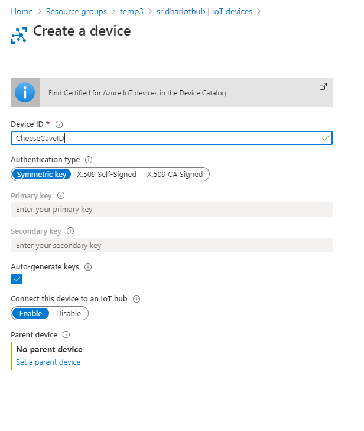
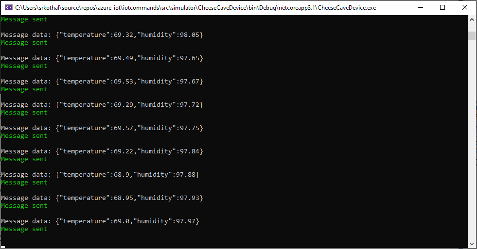
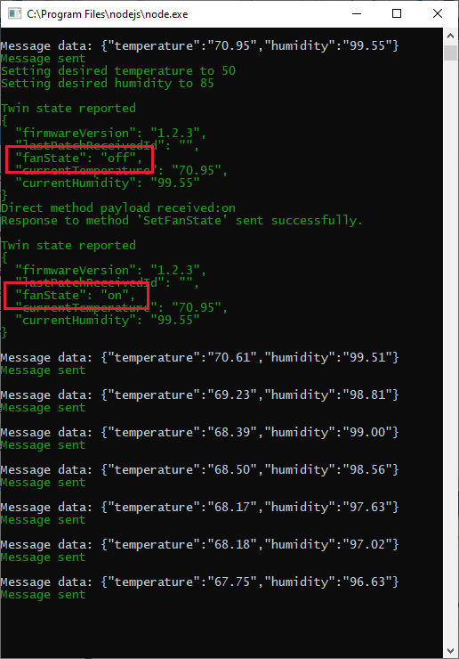
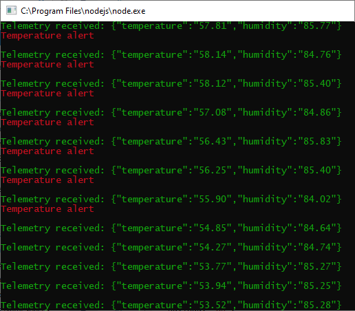

## Remotely monitor and control devices with Azure IoT Hub

#### Introduction
Azure IoT Hub is a cloud service that can handle large volumes of telemetry sent from remote devices. The remote devices 
typically contain a number of sensors (temperature, humidity, location, velocity, to name a few). These sensors send out 
telemetry on a regular basis. An IoT Hub processes this data in a number of ways, including storing it, or running a 
back-end app on the data. The IoT Hub also communicates new settings back to the devices.

An IoT Hub can scale to handle millions of devices. An IoT device can upload files, as well as send telemetry.

In this module, you'll learn about IoT Hub by implementing a system to monitor and control conditions in a cheese cave. 
A simple scenario, one IoT Hub, and one remote device.

#### Create a IoT Hub and add a device



**Note**:<br>
A single partition has a maximum number of concurrent readers processing data. In our cheese cave scenario, we only 
have one reader (the back-end service app), so could get away with one partition. However, if high telemetry throughput 
is an issue, increasing the number of partitions, and number of concurrent connected readers, will aid in increasing 
efficiency.

#### Get the Iot Hub inbuild endpoint


Alternately, you can use CLI
```
az iot hub show --query properties.eventHubEndpoints.events.endpoint --name <YourIoTHubName>

az iot hub show --query properties.eventHubEndpoints.events.path --name <YourIoTHubName>

az iot hub policy show --name service --query primaryKey --hub-name <YourIoTHubName>
```

#### Write code to send and receive telemetry

Telemetry is the output from sensors. There are many different types of sensors. Acceleration, humidity, location, 
pressure, temperature and velocity are most commonly used in commercial applications. Other sensors include radiation, 
motion-sensitivity, acoustics, air quality, heart rate, and so on. And they all pump out telemetry for some other process
to consume.

The frequency of telemetry output is an important factor. A temperature sensor in a refrigeration unit may only have to 
report every minute, or less. An acceleration sensor on an aircraft may have to report at least every second.

An IoT device may contain one or more sensors, and have some computational power. There may be LED lights, and even a 
small screen, on the IoT device. However, the device isn't intended for direct use by a human operator. An IoT device 
is designed to receive its instructions from the cloud.

#### Controlling a cheese cave device
In this module, we assume the IoT cheese c ave monitoring device has temperature and humidity sensors. The device has a 
fan capable of both cooling or heating and humidifying or dehumidifying.

We assume, the fan can be in one of three states: _on_, _off_, and _failed_. The fan is initialized to the _off_ state. 
The fan can be turned on by use of a _direct_ method.

Another feature of our IoT devices is that it can accept _desired_ values from the IoT Hub. The device can then adjust its 
fan to target these desired values. These values are coded in this module using a feature called _device twins_. Desired
values will override any default settings for the device.

#### Write code to send and receive telemetry

**Send app**

The code under the src/simulator folder sends telemetry



**Receiver app**

The code under the src/operator folder receives telemetry


When you run both the programs you can see that messages as soon as they are send appear in the receiver app.

#### Write code to invoke a direct method

A _direct method_ is a function on the device that can be invoked by the back-end-app. Direct methods can include multipe 
parameters. 

Direct methods require that the back-end app prepares the parameters, then makes a call specifying a single device to 
invoke the method. The back-end app will then wait for, and report, a response. Included in the call for the back-end 
app is a timeout, in seconds. The expectation is the back-end app will have to run a different code path, if the device
fails to respond, or responds with an error.

The function name is registered with the IoT client for the device. This process ensures the client knows what function
to run when the call comes from the IoT Hub.


#### Write code for device twin

An IoT Hub will maintain, in the cloud, a _device twin_ for each device connected to it. A device twin is a JSON 
document containing state, configuration data, metadata, and similar information on each device. Device twins are designed
for querying, and automatically synchronizing, with the real IoT Hub device.

A device twin maintains information on a device, that the device itself does not have access to. This kind of information
is called tags. Tags might include information such as customer IDs, connectivity specifics, and location.


**Query device twins**

The device twin can be queried, at any time, by the backend app. This query will return the current state information for 
the device. Getting thsi data doesn't involve a call to the device, as the device and twin will have synchronized
automatically.

Much of the functionality of device twins is provided by Azure IoT, so not much code needs to be written to make use of them.

The device twin contains four type of information:
* **Tags**: information on the device that isnt visible to the device
* **Desired properties**: the desired settings specified by the back-end-app
* **Reported properties**: the reported values of the settings on the device
* **Device identity properties**: read-only information identifying the device

There's some overlap between the functionality of device twins, and direct methods. We could set desired properties 
using direct methods, which might seem an intuitive way of doing things. However, using direct methods would require the 
back-end app to record those settings explicitly, if they ever needed to be accessed. Using device twins, this information
is stored and maintained by default.

#### Add code to use device twins to synchronize device properties

1. Start the telemetry running, by starting the device app
2. Start the backend service app
3. Check the console window for the device app, configming the device twin synchronized correctly



If we let the fan do its work, we should eventually get rid of those red alerts




