## Azure Stream Analytics

#### Overview

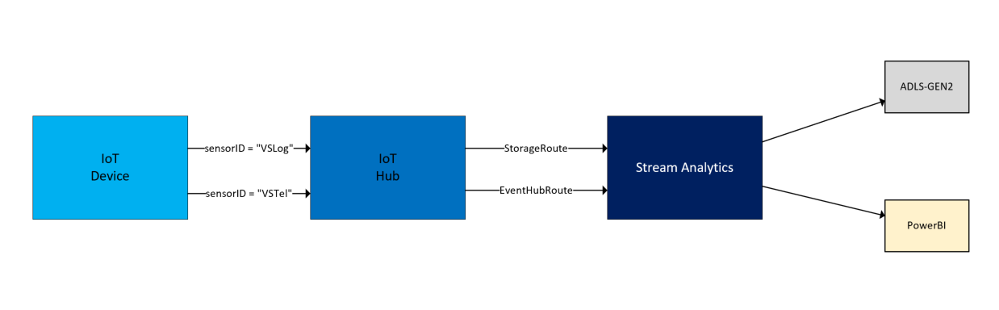
In this example a iot device is sending two telemetry and sets the "sensorID" accordingly. In IoT hub we
create two routes and split the telemetry accordingly to the "sensorID". Data in one route is moved to ADLS-GEN2 storage
and the other route is moved to PowerBI. 

#### Create a IoT Hub


#### Add a device
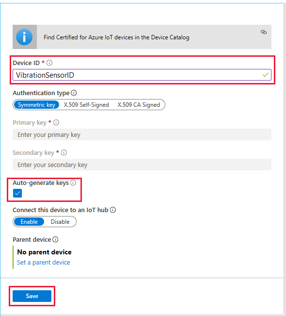

#### Vibration 
The key to monitoring our conveyor belt is the output of vibration telemetry. Vibration is usually measured as an acceleration (m/s2), although sometimes it's measured in g-forces, where 1 g = 9.81 m/s2. There are three types of vibration.

* Natural vibration, which is just the frequency a structure tends to oscillate.
* Free vibration, which occurs when the structure is impacted, but then left to oscillate without interference.
* Forced vibration, which occurs when the structure is under some stress.

Forced vibration is the dangerous one for our conveyor belt. Even if it starts at a low level this vibration can build so that the structure fails prematurely. There's less of a case for free vibration in conveyor belt operation. Most machines, as we all know, have a natural vibration.

The natural vibration will vary from a minimum to a maximum level, similar to the following diagram.

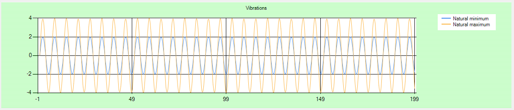

Forced cyclic vibration will also vary from a minimum to a maximum level

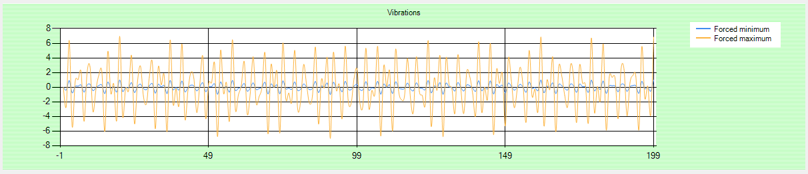

When forced vibration is added to natural vibration, the resulting vibration wave gets more complicated.

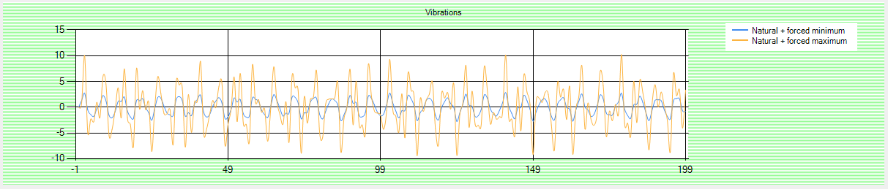

Increasing vibration starts almost undetectable

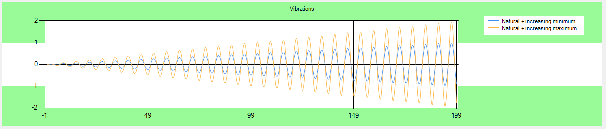

When we add all three vibrations, notice how the extreme highs and lows slowly increase

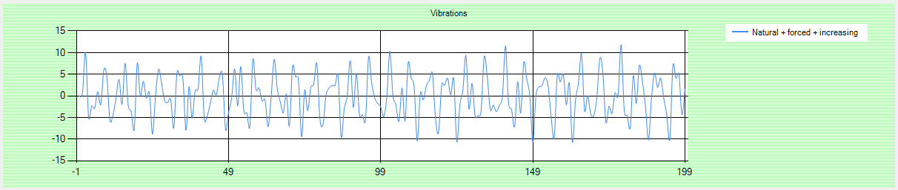

#### Create a message route to Azure blob storage

The architecture of our vibration monitoring system requires data be sent to two destinations:
* storage
* analysis
Azure IoT provides a great method of directing dta to the right service, through _message routing_

*Sending data into cloud storage*
In our scenario, we need one route to storge, which wwe will keep simple and use Azure Blob storage (though Data Lake 
storage is also available). The key feature of message routing is the filtering of incoming data. The filter, written in 
SQL, streams output down the route only when certain conditions are met.

One of the easiest ways to filter data is on a message property, which is why we added these two lines to our code:
```
    ...
    telemetryMessage.Properties.Add("sensorID", "VSTel");
    ...
    loggingMessage.Properties.Add("sensorID", "VSLog");
```
An SQL query embedded in our message route can test the `sensorID` value

*Analyze data for anomalies hidden in plain sight*
The second route will be to an Event Hub, because an Event Hub is a convenient input to Stream Analytics. And Stream Analytics
is a convenient way of handling anomaly detection.

Anomalies in data include the excessive vibration we are looking for in our scenario. Anomalies also include such things as
fraud detection, identifying of outliers, and identifying hidden trends. And any scenario where something isnt right,
but the trouble can be well hidden in the sheer mass of data.

In addition to storage and Event Hubs, messages can be routed to Azure Service Bus Queues, and Azure Service Bus Topics. 
Service Buses can be used to decouple apps and services. This decoupling allows for situations such as the app client 
and service not being online at the same time. Also there might be one provider of data, but many subscribers to that data.
Deferring messages for later analysis is another use of Service Buses.

#### Stream Analytics Job
A Stream Analytics job takes one or more inputs, runs the data through an SQL query, and returns results to one or more 
outputs.

#### Create a message route to blob storage

*Create a storage account
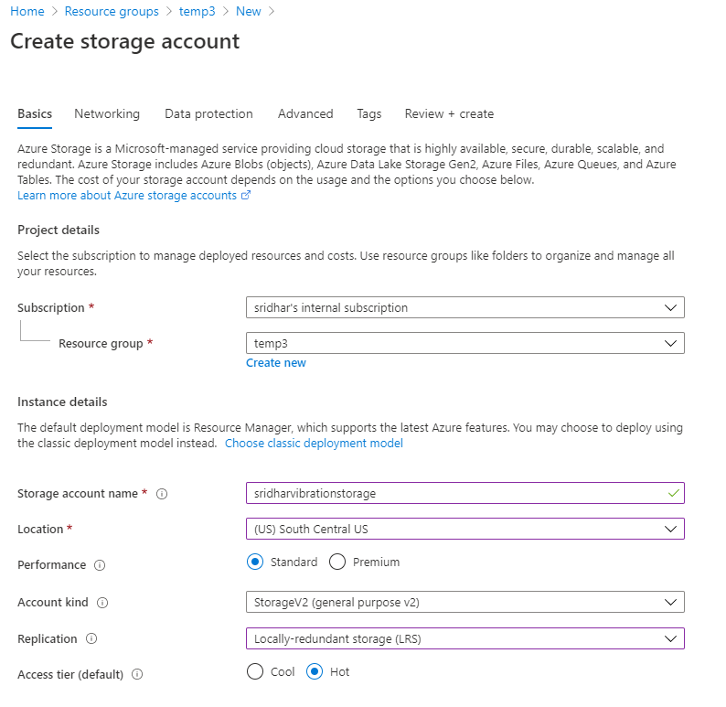

*Create a route
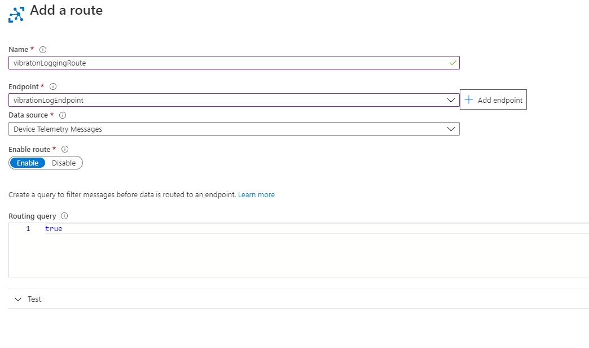

*Create a message route in IoT Hub
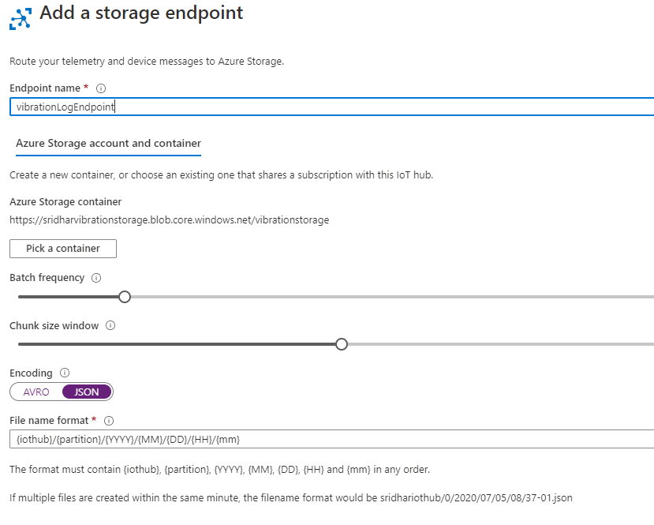

*Change the routing query
```
sensorID = "VSLog"
```
This query is an important step, determining which messages are to follow this route.
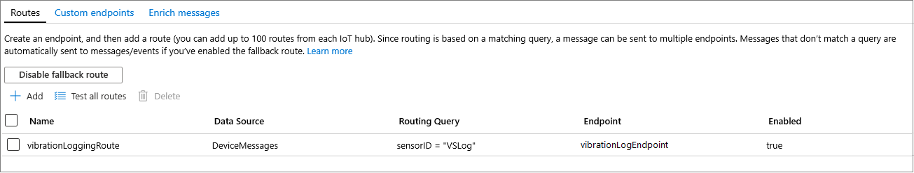

**Verify the logging route is working**

Open the storage account and see if data is getting written to the container

**Note**: before a route is added you can add a stream analytics job to read the "$Default" consumer group and write the 
output to storage. However, once a route is added then the messages will be routed directly and written to storage. As
a result of that the messages will not arrive to the "$Default" consumer group

#### Event hub route and query to detect anomalies
1. Create an event hub namespace
2. Create an event hub instance (note an event hub instance is like a topic in kafka)
3. Create a route to an event hub
    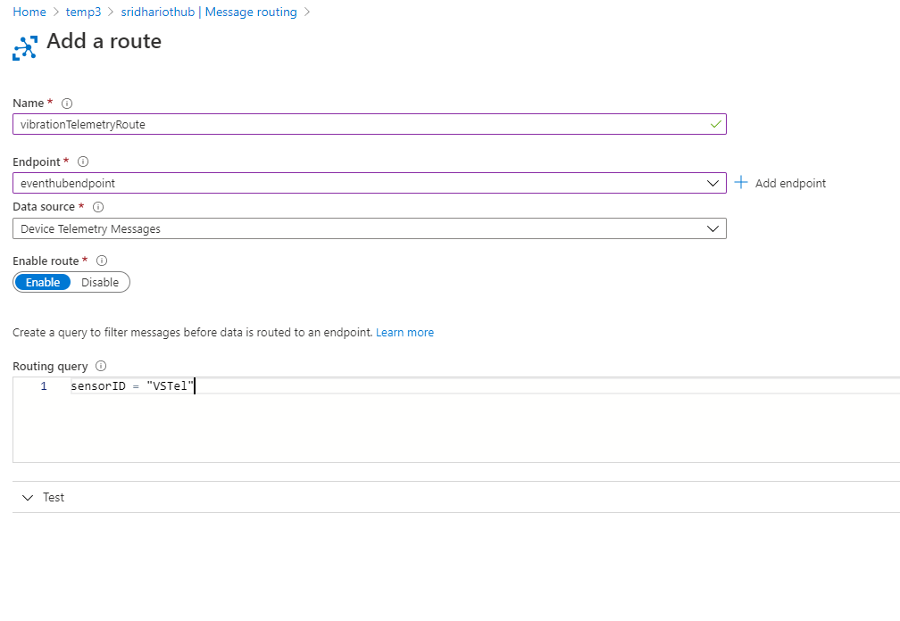
    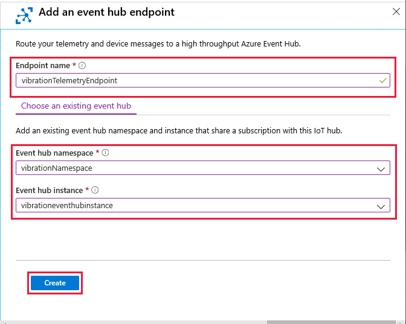
    Note:<br>
    Make sure to update the query
    ```
    sensorID = "VSTel"
    ```
4. Check the routes  
    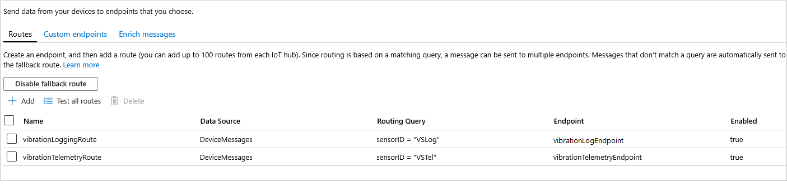
    
#### Update Azure Stream Analytics Job query
Once the route has been added to IoT Hub, we need to updte the stream analytics job.

Add a second input

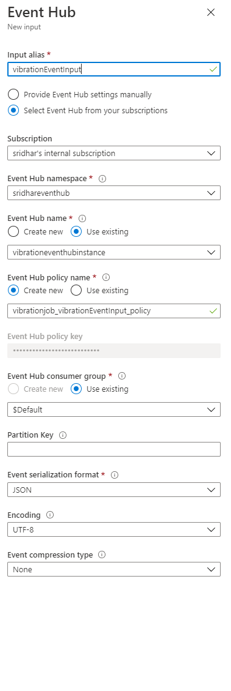

Add a second output

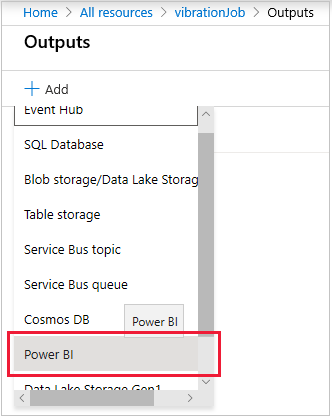
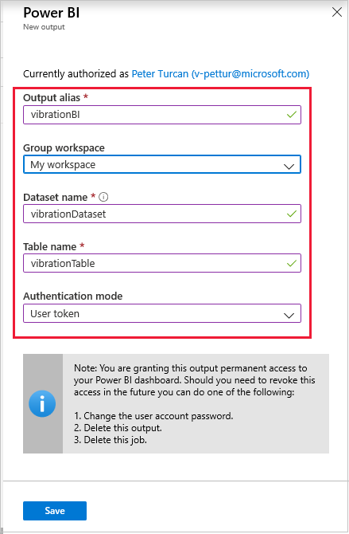

Update the query
Add the following at the begining of the existing query
```
WITH AnomalyDetectionStep AS
 (
     SELECT
         EVENTENQUEUEDUTCTIME AS time,
         CAST(vibration AS float) AS vibe,
         AnomalyDetection_SpikeAndDip(CAST(vibration AS float), 95, 120, 'spikesanddips')
             OVER(LIMIT DURATION(second, 120)) AS SpikeAndDipScores
     FROM vibrationEventInput
 )
 SELECT
     time,
     vibe,
     CAST(GetRecordPropertyValue(SpikeAndDipScores, 'Score') AS float) AS
     SpikeAndDipScore,
     CAST(GetRecordPropertyValue(SpikeAndDipScores, 'IsAnomaly') AS bigint) AS
     IsSpikeAndDipAnomaly
 INTO vibrationBI
 FROM AnomalyDetectionStep
```
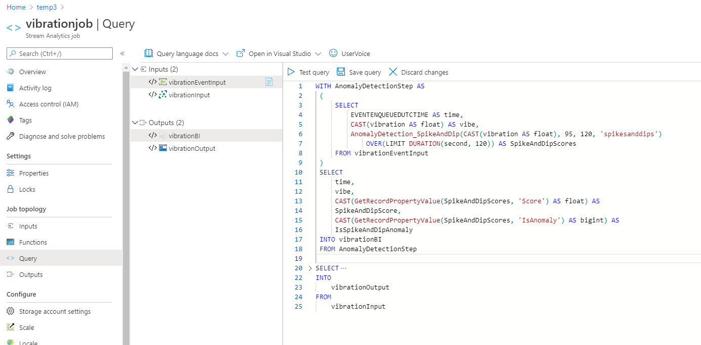

Note: 
* The first section of this query takes the vibration data and examins the previous 120 seconds worth. The
_AnomalyDetection_SpikeAndDip_ function will return a _score_ parameter, and an _IsAnomaly_ parameter. The score is 
how certain the ML model is that the given value is an anomaly, specified as a percentage. If the score exceeds 95%, the 
_IsAnomaly_ parameter has a value of 1, otherwise _IsAnomaly_ has a value of 0.
* The econd section of the query sends the time, vibration, and anomaly parameters to _vibrationBI_

#### Create a dashboard to visualize the query, using PowerBI

1. In your browser, navigate to outlook.office365.com. This URL will take you to the mail inbox. You may have to enter 
your Microsoft Account login information.
2. Use the nine dots icon (top left) to display a drop-down list. Select All apps. Scroll down and select Power BI.

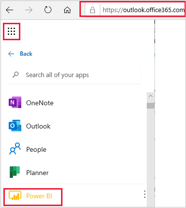
3. Open My workspace.
4. Under Datasets verify that vibrationDataset is displayed. If not, you might have to wait a short time for this list 
to populate.
5. Select + Create (top right), and select Dashboard from the drop-down list.
6. Give the dashboard a friendly name, say "Vibration dash".
7. In the blank screen that follows, click Add tile. Select Custom Streaming Data, Next, and select the vibrationDataset 
from the list of datasets.

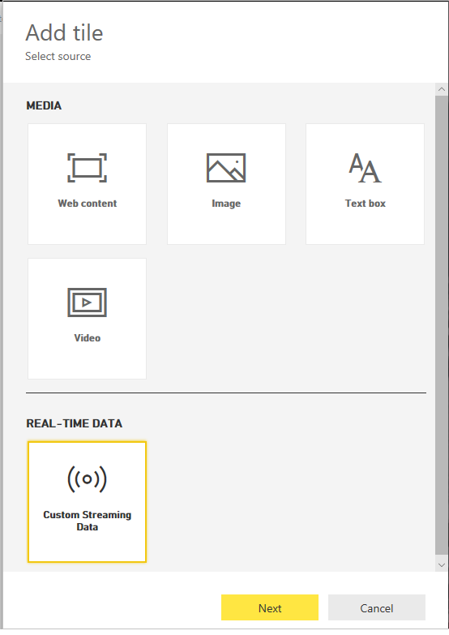
8. For the first card, select Visualization Type as Gauge, Value as vibe. Click Next, then enter "Vibration" for the title (in the Tile details box).
9. Click Apply.
10. Use the bottom-right corner icon on the tile to shrink it to the smallest allowable size.
11. Repeat the process, with the same dataset and tile source, for a second tile. This time with Clustered bar chart as the Visualization Type, and SpikeAndDipScore as the Value. No need to add a title, click Next, then Apply.
12. Again, shrink this tile to the smallest possible.
13. Create a third tile. This time with Card as the Visualization Type, and IsSpikeAndDipAnomaly under Fields. Again, click Apply, and shrink the tile.
14. Now create a fourth tile, this time a bit more complex. Select Line chart for the Visualization Type, and time for the Axis. Under Values, again select IsSpikeAndDipAnomaly. For the time window, select the last 60 minutes. Enter "Anomalies over the hour" for the tile title. Click Apply.
15. This time, expand the tile to a size three times larger than the smallest tiles, and arrange your dashboard similar to the following image:
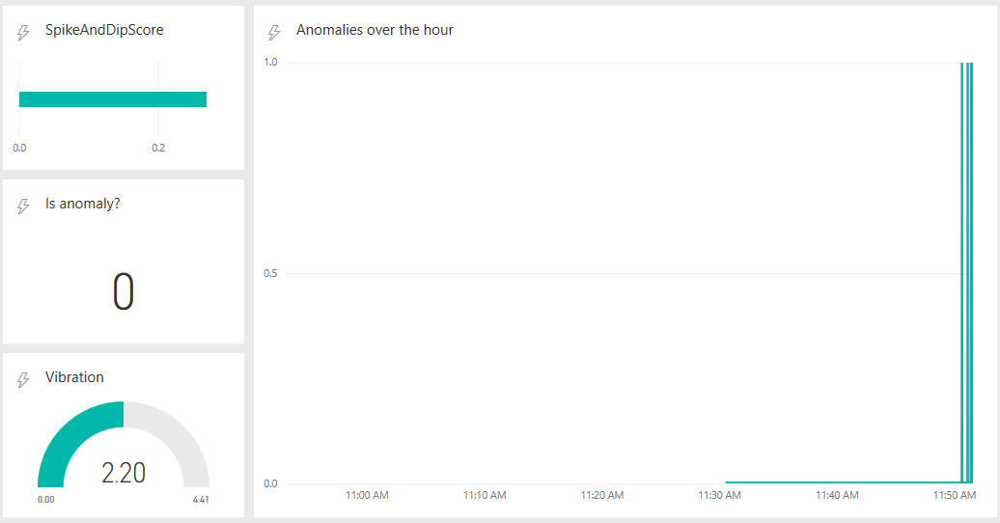
16. There's a latency with so many routes and connections, but are you now seeing the vibration data coming through?
17. Let the job run for a while, several minutes at least before the ML model will kick in. Compare the console output of the device app, with the Power BI dashboard. Are you able to correlate the forced and increasing vibrations to a run of anomaly detections?


    


